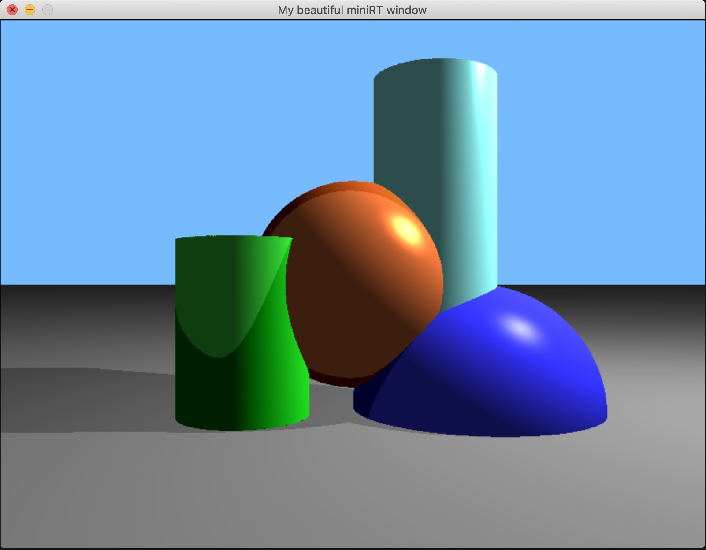
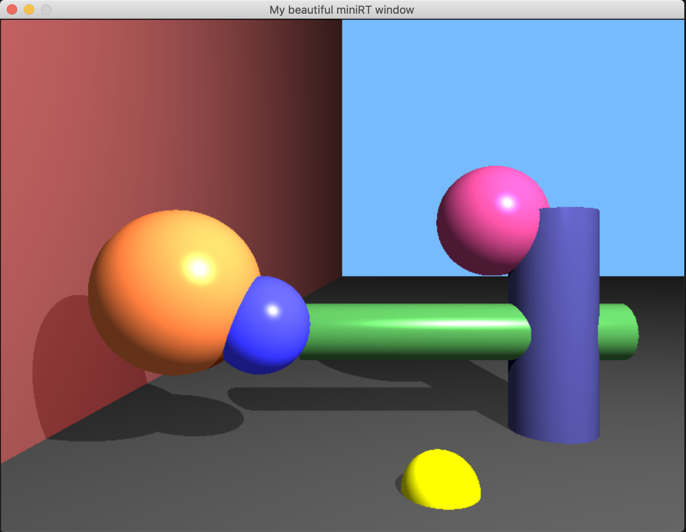
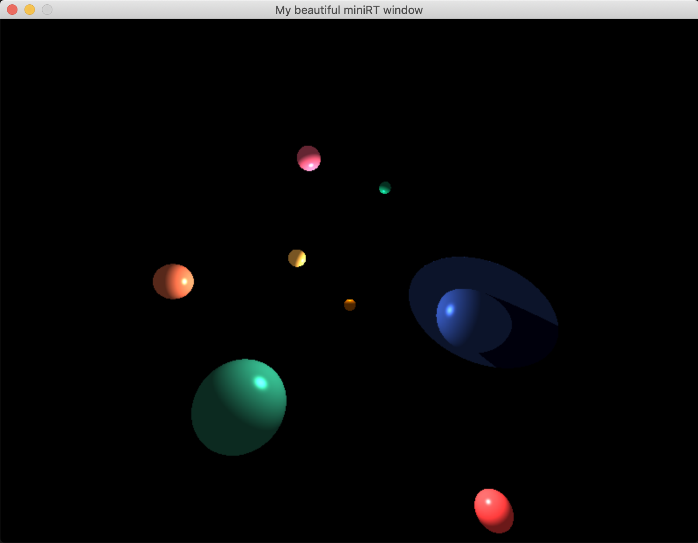

Учебный проект в "Школе 21" - мини рэй-трейсинг

Задача - рендерить 3Д-сцену, состоящую из сфер, цилиндров, плоскостей, источника света и камеры. С возможностью перемещать камеру, объекты и источник света. 

Сцена задаётся в файле формата .rt, где описаны координаты и характеристики объектов (папка maps).

Скомпилировать: `make`

Запустить: `./miniRT [путь к карте]`

Например: `./miniRT maps/planets.rt`

Управление:
```

[esc]                              [7] [8] [9]
Exit                               [4]     [6]
         [W]                       [1] [2] [3]
     [A] [S] [D]                Object movement
    Camera rotation             & transformation

[⬆ shift]                ᐃ               [+]
[^ctrl]                ᐊ ᐁ ᐅ             [-]
Zoom +/-        Camera movement         Resize
                                        object
Left Mouse button - select object
Right mouse button - select light
```


Примеры сцен:






