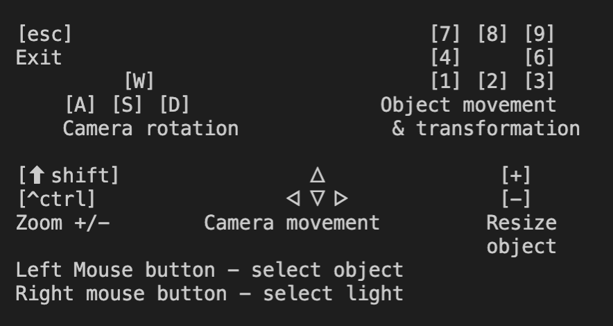

Учебный проект в "Школе 21" - мини рэй-трейсинг

Задача - рендерить 3Д-сцену, состоящую из сфер, цилиндров, плоскостей, источника света и камеры. С возможностью перемещать камеру, объекты и источник света. 

Сцена задаётся в файле формата .rt, где описаны координаты и характеристики объектов (папка maps).

Управление:

Примеры сцен:

